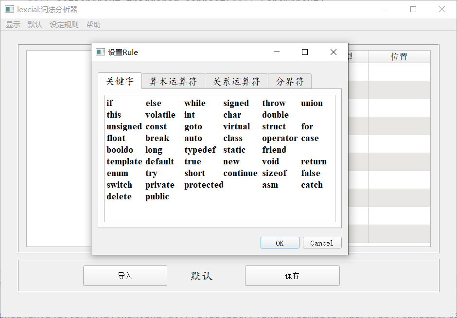
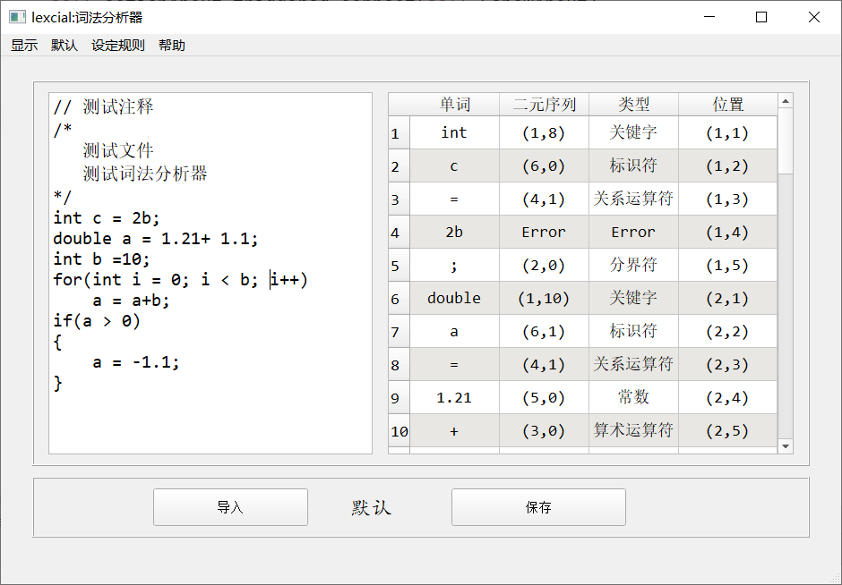
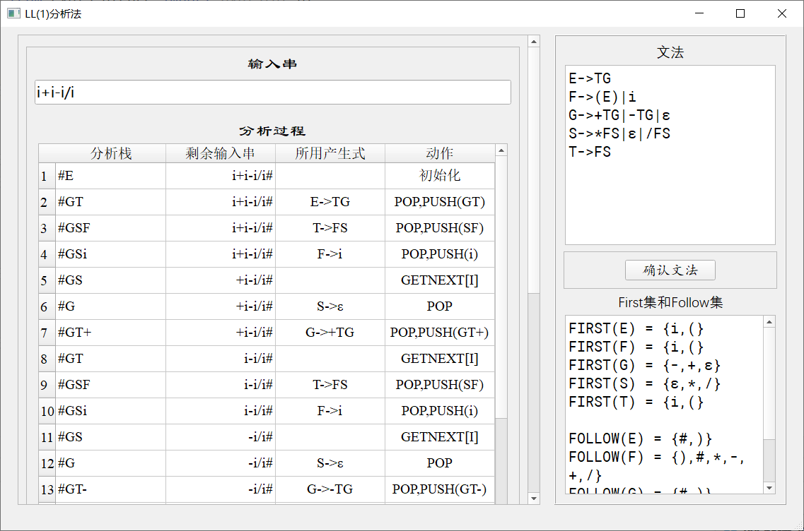
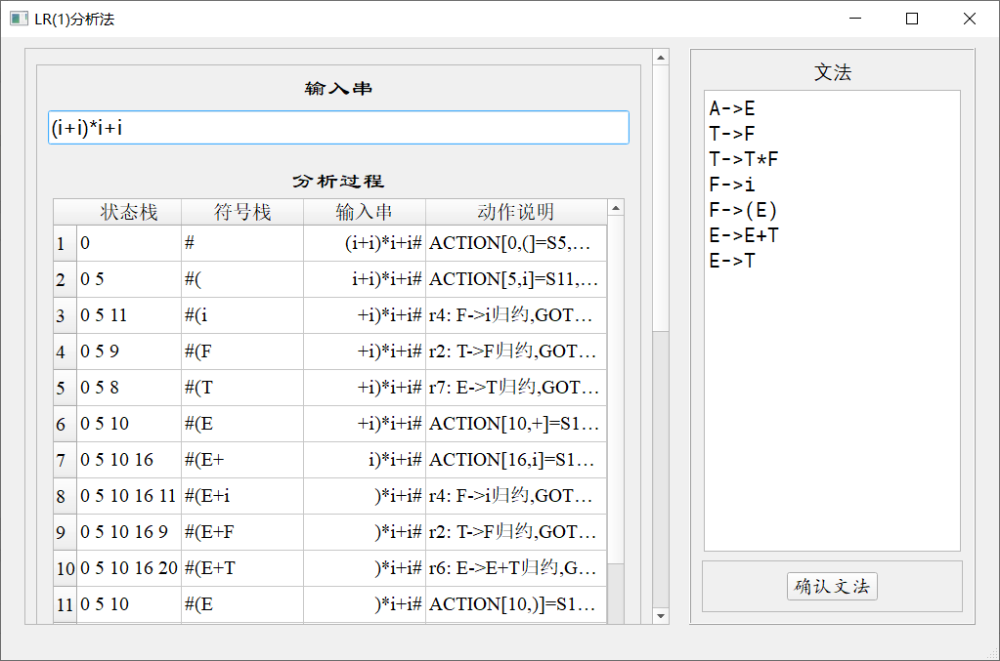

# 编译原理实验

​	大二下编译原理实验

​	日期：2019年5月

## 环境说明

+ Python 3.7
+ 基于Pyqt5开发界面

## 项目文件夹说明

| 文件夹名 | 说明         |
| -------- | ------------ |
| lexicial | 词法分析项目 |
| LL1      | LL1文法项目  |
| LR1      | LR1文法项目  |

## 词法分析

## LL1分析法

## LR1分析法

